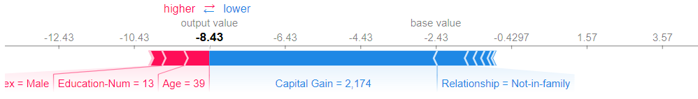
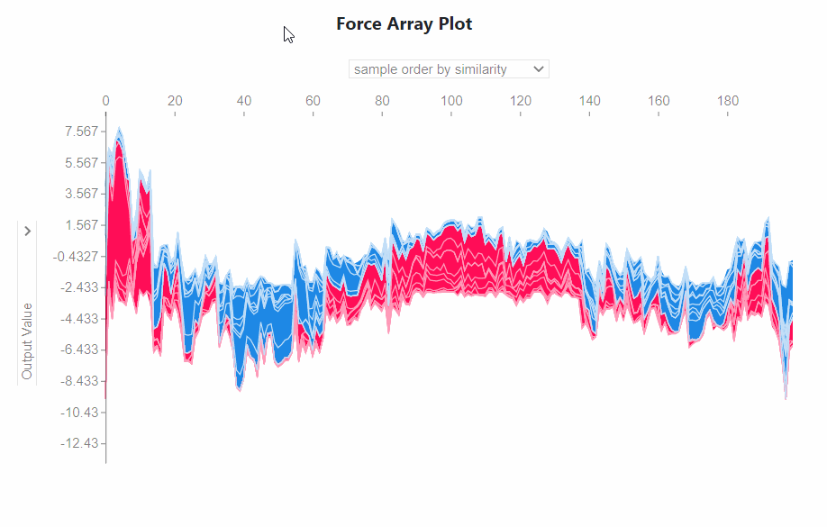

# Dash SHAP Components


Dash SHAP Components is a Dash component library, a slick wrapper on top of
 [shapjs](https://www.npmjs.com/package/shapjs) library, created using the [dash component boilerplate](https://github.com/plotly/dash-component-boilerplate)
You can learn more about SHAP analysis from the [docs](https://shap.readthedocs.io/en/latest/index.html)

Only Force Plots and Force-Array plots are integrated in this package:

###Force Plots:


###Force Array Plots:


To use this component, install into your env using pip
```
$ pip install dash_shap_components
```

## Contributing

See [CONTRIBUTING.md](./CONTRIBUTING.md)
